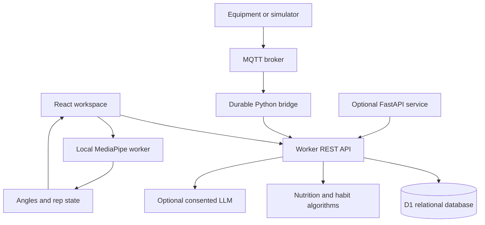
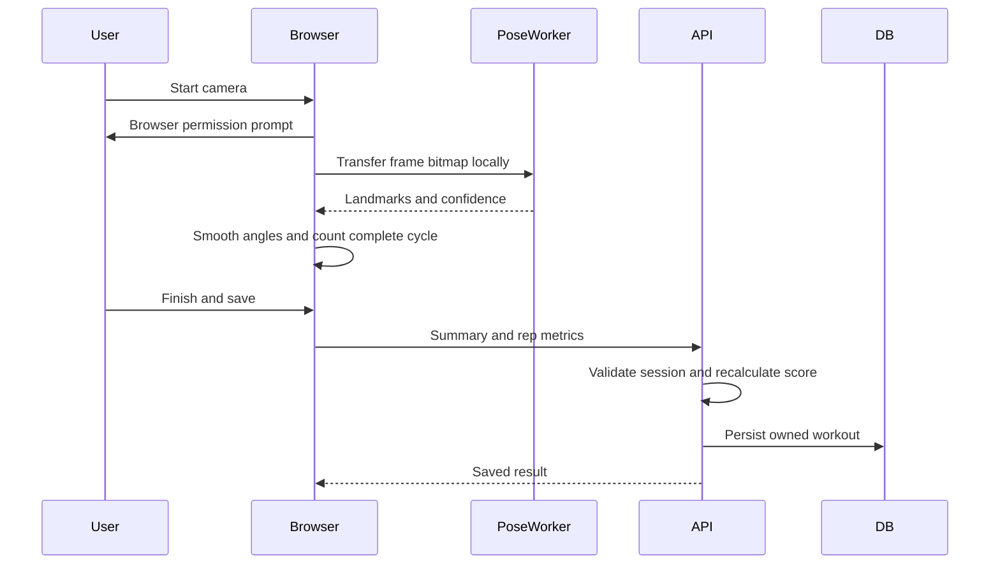
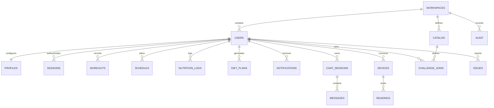

# Architecture and data flow

FORM uses one authoritative application API and database. The optional Python and MQTT adapters speak the same authenticated telemetry contract; swapping a simulated publisher for hardware does not change the UI or database schema.

The camera pipeline never sends image frames to the API. It submits only workout summaries and per-repetition duration/range/form/tempo. The backend recomputes the aggregate score and checks schema/ownership. Browser metrics are user-controlled and must not be treated as fraud-resistant competition evidence.

## Modules and boundaries

- UI screens own transient form/dialog/camera state. Shared context owns a validated server snapshot and mutation/reload behavior.
- API dispatch enforces body size, CSRF, authentication, throttling and predictable errors. Entity routes additionally scope every lookup to user or workspace.
- Algorithm modules are pure apart from UUID generation for plans; fixtures test mathematical behavior without network/model dependencies.
- D1 queries use prepared bindings. Multi-record mutations use atomic batches. FK cascading handles workspace/account cleanup.
- Worker credentials, chat-provider keys and device token hashes stay server-side. Camera and location permissions are requested only on action.
- Model assets are same-origin, versioned files. Heavy charts/screens load lazily; inference runs outside the main UI thread.

## Data model

`rate_limits` is a separate hashed-key counter table. IDs are UUIDs except opaque session-token hashes and idempotent notification keys. Major indexes support user/date workout and food queries, workspace/kind catalog queries, and device/sequence lookup. The actual schema and migration are authoritative.

Profile preferences and heterogeneous catalog payloads use validated JSON, while identity, ownership, sessions, workouts, logs, schedules, messages and telemetry are relational. Per-rep metrics are immutable JSON within each workout to avoid high-frequency write amplification. Performance fields are stored with the raw metrics needed to explain them. There is no separate claimed training-data warehouse.

## Design decisions

The supported host runs Workers and D1. A TypeScript backend avoids an unavailable always-on Python/PostgreSQL deployment. The optional FastAPI service demonstrates interoperable numerical APIs and equipment forwarding. The UI uses the primary Worker directly, avoiding duplicated accounts and eventual-consistency failures. The schema is SQLite-specific; a future PostgreSQL migration requires dialect/migration work and is not portrayed as already done.

A workspace boundary protects personal tenants and isolated admin demonstrations. Real operators can promote a verified account with the local operator utility or privileged managed-DB tooling. The public signup API cannot assign roles or join arbitrary workspaces. Site-level access control is independent from application account permissions.
